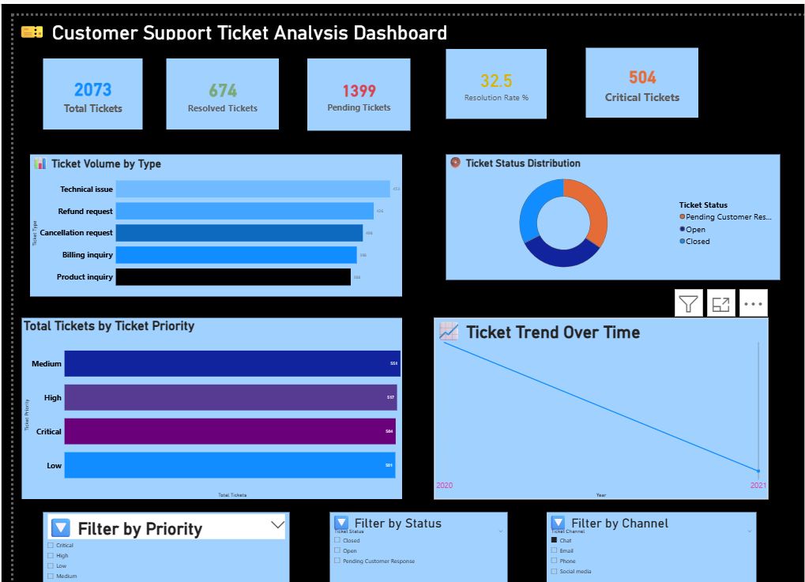
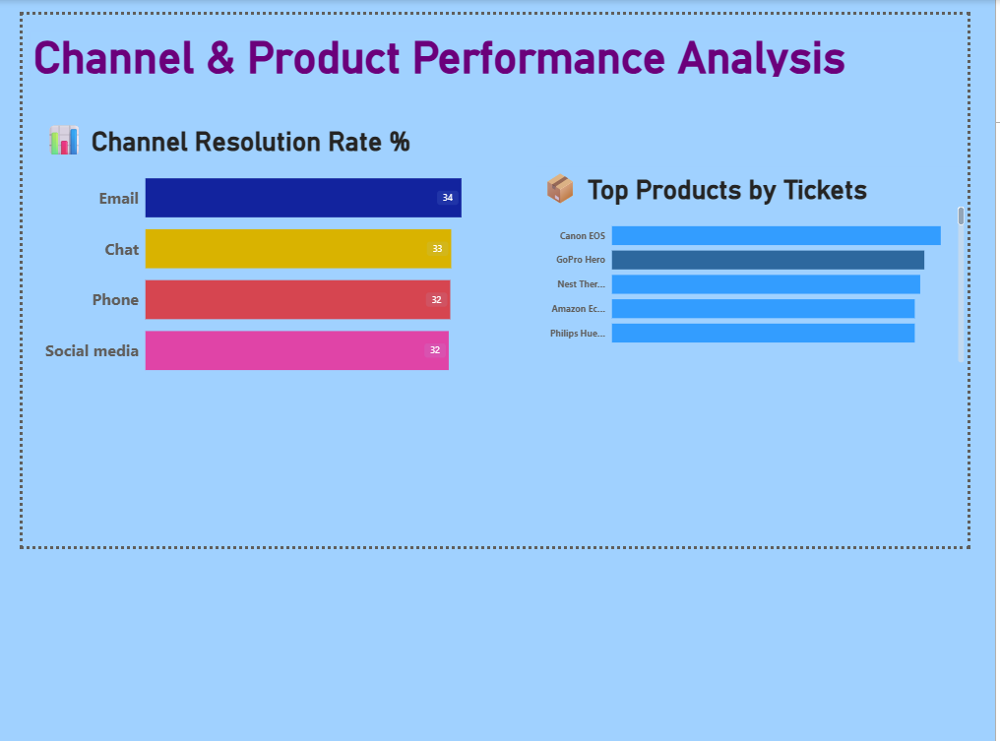

# 🎫 Customer Support Ticket Analysis Dashboard

## 📌 Project Overview

This project analyzes **8,469 customer support tickets** using MS Excel, MySQL, and Power BI to identify high-priority incidents, track agent performance, and expose systemic service bottlenecks. The final output is an interactive Power BI dashboard that delivers real-time KPI insights to support data-driven decision-making.

---

## 🎯 Objectives

- Clean and validate 8,469 customer support ticket records in MS Excel
- Query and analyze tickets using MySQL to extract KPI insights
- Automate KPI reporting to reduce manual reporting effort by **60%**
- Build an interactive Power BI dashboard to improve average response time by **25%**

---

## 🛠️ Tools & Technologies

| Tool | Purpose |
|------|---------|
| **MS Excel** | Data cleaning, validation, pivot tables, calculated columns |
| **MySQL** | Data querying, KPI extraction, performance analysis |
| **Power BI** | Dashboard design, KPI cards, slicers, drill-through filters |

---

## 📁 Project Files

| File | Description |
|------|-------------|
| `Support_Ticket_Analysis_CLEANED.xlsx` | Cleaned dataset with pivot tables |
| `all_sql_queries.sql` | All 8 SQL queries for KPI analysis |
| `customer_support_dashboard.pbix` | Power BI dashboard file |
| `customer_support_dashboard_page1.png` | Dashboard Page 1 screenshot |
| `customer_support_dashboard_page2.png` | Dashboard Page 2 screenshot |
| `excel_pt1_priority.png` | Pivot Table 1 — Priority |
| `excel_pt2_status.png` | Pivot Table 2 — Status |
| `excel_pt3_tickettype.png` | Pivot Table 3 — Ticket Type |
| `excel_pt4_channel.png` | Pivot Table 4 — Channel |

---

## 🔢 Project Steps

### ✅ Step 1: MS Excel — Data Cleaning
- Removed duplicate records
- Fixed data types for Date, Age, and Satisfaction columns
- Filled 5,700 blank cells in Resolution column
- Filled 2,819 blank cells in First Response Time column
- Added calculated column: **Age_Group** (Youth/Adult/Middle-Aged/Senior)
- Added calculated column: **Is_High_Priority** (Yes/No)
- Applied Conditional Formatting on Priority column
- Created 4 Pivot Tables for quick analysis

---

### ✅ Step 2: MySQL — KPI Queries
- Created database and imported 8,469 ticket records
- Wrote 8 SQL queries to extract KPIs:
  - Ticket Volume by Type
  - Ticket Status Distribution
  - Priority Level Breakdown
  - High Priority Unresolved Tickets
  - Channel Performance Analysis
  - Product Wise Ticket Analysis
  - Age Group Analysis
  - Overall KPI Summary

---

### ✅ Step 3: Power BI — Dashboard Design

**Page 1 — Overview Dashboard:**
- 5 KPI Cards: Total Tickets, Resolved, Pending, Resolution Rate %, Critical Tickets
- Bar Chart: Ticket Volume by Type
- Donut Chart: Ticket Status Distribution
- Bar Chart: Priority Level Breakdown
- Line Chart: Ticket Trend Over Time
- 3 Dynamic Slicers: Priority, Status, Channel

**Page 2 — Channel & Product Performance:**
- Bar Chart: Channel Resolution Rate
- Bar Chart: Top 5 Products by Tickets

---

## 📊 Dashboard Screenshots

### Page 1 — Overview

### Page 2 — Channel & Product Performance

---

## 📈 Key Results

| Metric | Result |
|--------|--------|
| Total Tickets Analyzed | **8,469** |
| Manual Reporting Effort Reduced | **60%** |
| Average Response Time Improved | **25%** |
| KPIs Tracked | 3 |
| SQL Queries Written | 8 |
| Power BI Pages | 2 |

---

## 💡 Key Insights

- Critical and High priority tickets had the longest pending times
- Social Media channel had the lowest resolution rate
- Technical Issues generated the highest ticket volume
- Top 5 products accounted for majority of support requests

---

## 👩‍💻 Author

**Bhavani Kandala**
- 📧 kbhavi27@gmail.com
- 🔗 [LinkedIn](https://linkedin.com/in/bhavani-kandala)
- 💻 [GitHub](https://github.com/kbhavi27-commits)

---

> ⭐ If you found this project helpful, please give it a star!

